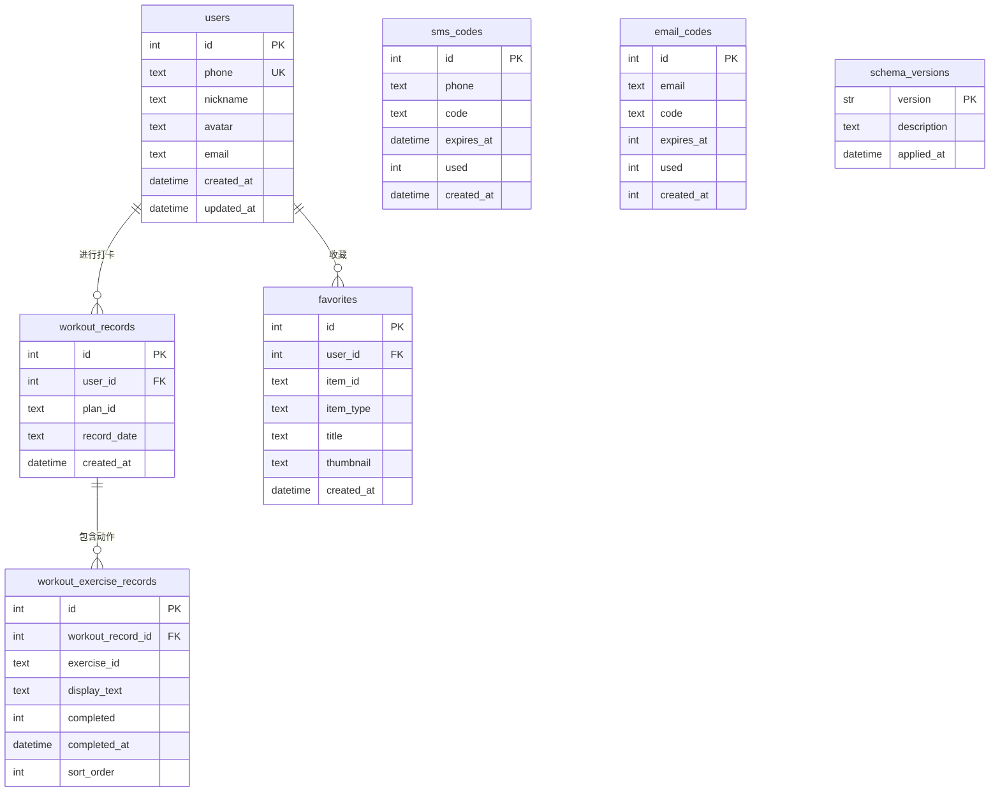

# WristLab 数据库设计文档

> 本文档描述 WristLab 项目的数据库架构、表关系、数据流及设计决策。
> 最后更新：2026-07-12（添加 migration 机制）

---

## 一、数据库概览

### 数据库类型

- **引擎**：SQLite（通过 [sql.js](https://github.com/sql-js/sql.js) WASM 实现）
- **访问方式**：`server/db.cjs` 封装了所有数据库操作，上层通过导出函数调用
- **ORM**：无。使用原生 SQL 语句 + `queryOne()` / `execute()` 辅助函数
- **Schema 管理**：基于 `schema_versions` 表的迁移框架。迁移文件位于 `server/migrations/`（`.cjs` 文件）。启动时自动检测并执行未应用的迁移
- **持久化**：进程内 WASM 内存数据库 + 文件保存模式（`saveDb()` / `scheduleSave()`）
- **数据库文件**：`server/fit_hub.db`（自动创建）
- **SQLite Pragma**：
  - `PRAGMA journal_mode=WAL` — 启用 WAL 模式（sql.js WASM 中为无操作，但保留兼容）
  - `PRAGMA foreign_keys=ON` — 强制外键约束（**必须**，否则 ON DELETE CASCADE 不生效）

### 数据库整体用途

WristLab 采用**混合数据架构**：

| 数据类别 | 存储位置 | 说明 |
|----------|----------|------|
| 用户身份 & 鉴权 | SQLite | 手机号、昵称、头像、邮箱、验证码 |
| 用户行为数据 | SQLite | 训练打卡记录、收藏内容 |
| 课程/动作/计划 | 前端 TS 文件 | `courses.ts`、`exercises.ts`、`plans.ts`（静态数据） |
| 知识库 | 前端 TS 文件 | `knowledge.ts`（静态数据） |
| 用户偏好 | localStorage | 搜索历史、部分状态缓存 |

数据库**仅负责**：用户身份、鉴权、打卡记录、收藏同步。

---

## 二、数据表设计

当前共有 **7 张表**：`users`、`sms_codes`、`email_codes`、`workout_records`、`workout_exercise_records`、`favorites`、`schema_versions`。

---

### users

用户表。

| 字段 | 类型 | 是否为空 | 默认值 | 说明 |
|------|------|:--------:|--------|------|
| `id` | INTEGER | NOT NULL | AUTOINCREMENT | 主键，用户唯一标识 |
| `phone` | TEXT | NOT NULL | — | 手机号，中国大陆格式，**唯一** |
| `nickname` | TEXT | NULL | `''` | 用户昵称（最大 20 字符） |
| `avatar` | TEXT | NULL | `''` | 头像，支持 base64、URL、本地路径 |
| `email` | TEXT | NULL | NULL | 邮箱地址（通过 ALTER TABLE 后加） |
| `created_at` | DATETIME | NULL | CURRENT_TIMESTAMP | 注册时间 |
| `updated_at` | DATETIME | NULL | CURRENT_TIMESTAMP | 最后更新时间 |

- **主键**：`id`
- **唯一约束**：`phone`（登录凭证）; `email`（条件索引，`WHERE email IS NOT NULL`）
- **索引**：`idx_users_email`（部分索引，仅对非空 email）

---

### sms_codes

短信验证码表。

| 字段 | 类型 | 是否为空 | 默认值 | 说明 |
|------|------|:--------:|--------|------|
| `id` | INTEGER | NOT NULL | AUTOINCREMENT | 主键 |
| `phone` | TEXT | NOT NULL | — | 手机号 |
| `code` | TEXT | NOT NULL | — | 4 位验证码 |
| `expires_at` | DATETIME | NOT NULL | — | 过期时间（5 分钟） |
| `used` | INTEGER | NULL | `0` | 是否已使用（0=未用, 1=已用） |
| `created_at` | DATETIME | NULL | CURRENT_TIMESTAMP | 创建时间 |

- **主键**：`id`
- **无唯一约束**：同一手机号可以有多条验证码，验证时取最新未用的一条
- **无外键**：不与 users 表关联

---

### email_codes

邮箱验证码表。

| 字段 | 类型 | 是否为空 | 默认值 | 说明 |
|------|------|:--------:|--------|------|
| `id` | INTEGER | NOT NULL | AUTOINCREMENT | 主键 |
| `email` | TEXT | NOT NULL | — | 邮箱地址 |
| `code` | TEXT | NOT NULL | — | 6 位验证码 |
| `expires_at` | INTEGER | NOT NULL | — | 过期时间时间戳（ms） |
| `used` | INTEGER | NULL | `0` | 是否已使用（0=未用, 1=已用） |
| `created_at` | INTEGER | NOT NULL | — | 创建时间时间戳（ms） |

- **主键**：`id`
- **注意**：`expires_at` 和 `created_at` 使用 Unix 毫秒时间戳（INTEGER），与 `sms_codes` 的 DATETIME 类型不一致

---

### workout_records

训练打卡记录表。

| 字段 | 类型 | 是否为空 | 默认值 | 说明 |
|------|------|:--------:|--------|------|
| `id` | INTEGER | NOT NULL | AUTOINCREMENT | 主键 |
| `user_id` | INTEGER | NOT NULL | — | 用户 ID，**外键 → users(id)** |
| `plan_id` | TEXT | NULL | `''` | 训练计划 ID（如 `plan-21day`） |
| `record_date` | TEXT | NOT NULL | — | 打卡日期，YYYY-MM-DD 格式 |
| `created_at` | DATETIME | NULL | CURRENT_TIMESTAMP | 创建时间 |

- **主键**：`id`
- **外键**：`user_id → users(id)`
- **唯一约束**：`UNIQUE(user_id, record_date)` — 每天每用户只能打卡一次
- **无显式索引**：但 `UNIQUE(user_id, record_date)` 自动创建复合索引

---

### workout_exercise_records

训练动作级记录表（V1）。

| 字段 | 类型 | 是否为空 | 默认值 | 说明 |
|------|------|:--------:|--------|------|
| `id` | INTEGER | NOT NULL | AUTOINCREMENT | 主键 |
| `workout_record_id` | INTEGER | NOT NULL | — | 打卡记录 ID，**外键 → workout_records(id) ON DELETE CASCADE** |
| `exercise_id` | TEXT | NULL | NULL | 动作 ID，引用 `exercises.ts` 中的 Exercise.id（可选——非标准化动作如"散步"无此字段） |
| `display_text` | TEXT | NOT NULL | — | 展示文字，如"握力器挤压 3组×12次" |
| `completed` | INTEGER | NULL | `0` | 是否完成（0=未完成, 1=已完成） |
| `completed_at` | DATETIME | NULL | NULL | 完成时间（ISO 8601） |
| `sort_order` | INTEGER | NULL | `0` | 动作排序序号 |

- **主键**：`id`
- **外键**：`workout_record_id → workout_records(id) ON DELETE CASCADE`（删除打卡记录时自动删除子记录）
- **无显式索引**：`workout_record_id` 是查询热点，建议添加索引
- **exercise_id**：逻辑引用 `exercises.ts` 中的 Exercise.id，非数据库外键（Exercise 不在 DB 中）

---

### favorites

收藏表。

| 字段 | 类型 | 是否为空 | 默认值 | 说明 |
|------|------|:--------:|--------|------|
| `id` | INTEGER | NOT NULL | AUTOINCREMENT | 主键 |
| `user_id` | INTEGER | NOT NULL | — | 用户 ID，**外键 → users(id)** |
| `item_id` | TEXT | NOT NULL | — | 收藏项 ID（如课程 ID `aw-basic-grip`、动作 ID `ex-grip-crush`） |
| `item_type` | TEXT | NOT NULL | — | 收藏类型（`course` 或 `exercise`） |
| `title` | TEXT | NOT NULL | — | 收藏项标题 |
| `thumbnail` | TEXT | NOT NULL | — | 缩略图 URL |
| `created_at` | DATETIME | NULL | CURRENT_TIMESTAMP | 收藏时间 |

- **主键**：`id`
- **外键**：`user_id → users(id)`
- **唯一约束**：`UNIQUE(user_id, item_id, item_type)` — 同一用户不能重复收藏同一项
- **无显式索引**：但唯一约束自动创建复合索引

---

### schema_versions

Schema 迁移版本记录表。

| 字段 | 类型 | 是否为空 | 默认值 | 说明 |
|------|------|:--------:|--------|------|
| `version` | TEXT | NOT NULL | — | 版本号（如 `001`），**主键** |
| `description` | TEXT | NOT NULL | — | 迁移说明 |
| `applied_at` | DATETIME | NULL | CURRENT_TIMESTAMP | 应用时间 |

- **主键**：`version`
- **说明**：由 `server/db.cjs` 中的迁移框架自动管理。启动时读取已应用版本列表 → 扫描 `server/migrations/*.cjs` → 按序执行未应用的迁移。

---

## 三、表关系设计

### 关系总览

```
users (1) ───── (N) workout_records
users (1) ───── (N) favorites
workout_records (1) ───── (N) workout_exercise_records
```

### 一对一关系

无。当前设计中没有一对一关系。

### 一对多关系

| 左表 | 右表 | 外键 | 级联删除 | 业务含义 |
|------|------|------|:--------:|----------|
| `users` | `workout_records` | `workout_records.user_id` → `users.id` | ❌ | 一个用户有多次打卡 |
| `users` | `favorites` | `favorites.user_id` → `users.id` | ❌ | 一个用户有多个收藏 |
| `workout_records` | `workout_exercise_records` | `workout_exercise_records.workout_record_id` → `workout_records.id` | ✅ CASCADE | 一次打卡中有多个动作 |

### 多对多关系

无。所有关系均通过一对多实现。

### 逻辑关联（非数据库约束）

| 逻辑关联 | 说明 |
|----------|------|
| `workout_exercise_records.exercise_id` → `exercises.ts` 中的 `Exercise.id` | 动作数据在前端 TS 文件中，非数据库表 |
| `workout_records.plan_id` → `plans.ts` 中的 `Plan.id` | 计划数据在前端 TS 文件中，非数据库表 |
| `favorites.item_id` → `exercises.ts` 或 `courses.ts` 中的 ID | 收藏项 ID 引用前端静态数据 |

### 独立表（无外键关联）

| 表 | 说明 |
|----|------|
| `sms_codes` | 短信验证码，通过 phone 与 users 间接关联，无外键 |
| `email_codes` | 邮箱验证码，通过 email 与 users.email 间接关联，无外键 |

---

## 四、ER 图



---

## 五、数据流分析

### 1. 用户注册/登录（手机验证码）

```
用户输入手机号
  ↓
POST /api/auth/send-code
  ├─ checkRateLimit (内存 Map — 不是数据库)
  ├─ saveCode → INSERT sms_codes (phone, code, expires_at)
  ├─ sendSms → 阿里云短信 API
  └─ 返回结果
      ↓
用户输入验证码
  ↓
POST /api/auth/login
  ├─ verifyCode → SELECT sms_codes (phone+code+未过期+未使用)
  │                → UPDATE sms_codes SET used=1
  ├─ findOrCreateUser → SELECT/INSERT users (phone)
  ├─ 签发 JWT (userId, phone, 7天过期)
  └─ 返回 { token, user }
```

### 2. 打卡训练

```
用户在 PlanDetail 页面勾选动作
  ↓
点击"完成训练"
  ↓
POST /api/workouts/checkin
  ├─ INSERT workout_records (user_id, plan_id, today)
  |   UNIQUE(user_id, record_date) → 409 如果今天已打卡
  ├─ [V1] INSERT workout_exercise_records × N
  |   (workout_record_id, exercise_id, display_text, completed=1, completed_at)
  └─ 返回 { record, exercises[] }
```

### 3. 查看训练历史

```
GET /api/workouts/history?limit=30
  └─ getWorkoutRecords(userId, limit)
       ├─ SELECT workout_records WHERE user_id = ? ORDER BY record_date DESC LIMIT ?
       └─ 对每条记录: SELECT workout_exercise_records WHERE workout_record_id = ? ORDER BY sort_order
```

### 4. 训练统计

```
GET /api/workouts/stats
  └─ getWorkoutStats(userId)
       ├─ getWorkoutRecords(userId, 365)  → 获取一年记录
       ├─ 计算 total: records.length
       ├─ 计算 weekCount: 当前自然周内打卡天数
       ├─ 计算 streak: 从今天/昨天回溯连续天数
       └─ 计算 checkedToday: 最新记录是今天
```

### 5. 今日推荐训练

```
GET /api/workouts/today
  └─ 逻辑（非数据库操作):
       ├─ getWorkoutRecords(userId, 365) → 确定 planId
       ├─ getWorkoutStats(userId) → streak → dayIndex
       └─ 返回 { planId, dayIndex, checkedToday }
```

### 6. 收藏切换

```
用户在 CourseCard/ExerciseCard 点击♥
  ↓（乐观更新 localStorage）
POST /api/favorites/toggle
  ├─ SELECT favorites (user_id, item_id, item_type)
  ├─ 已有 → DELETE
  ├─ 没有 → INSERT
  └─ 返回最新收藏列表
```

### 7. 邮箱绑定

```
用户输入邮箱
  ↓
POST /api/auth/send-email-code
  ├─ invalidateEmailCodes → UPDATE email_codes SET used=1（废弃旧验证码）
  └─ saveEmailCode → INSERT email_codes (email, code, expires_at, created_at)
      ↓
用户输入验证码
  ↓
POST /api/auth/bind-email
  ├─ 校验验证码: SELECT email_codes (email+code+未用+未过期)
  ├─ 事务:
  │   ├─ UPDATE email_codes SET used=1
  │   ├─ SELECT users (email=?) 检查冲突
  │   └─ UPDATE users SET email=?
  └─ 返回更新后的用户信息
```

### 8. 获取个人信息

```
GET /api/auth/me
  └─ getUser(userId) → SELECT users (id)
PUT /api/auth/profile
  └─ updateUser(userId, fields) → UPDATE users SET ...
```

---

## 六、API 数据对应关系

| API | Method | 使用的数据表 | 操作 |
|-----|--------|-------------|------|
| `/api/auth/send-code` | POST | `sms_codes` | INSERT（保存验证码） |
| `/api/auth/login` | POST | `sms_codes`、`users` | SELECT + UPDATE（验证码）、SELECT + INSERT（用户） |
| `/api/auth/me` | GET | `users` | SELECT |
| `/api/auth/profile` | PUT | `users` | UPDATE |
| `/api/auth/send-email-code` | POST | `email_codes` | UPDATE（作废旧码）+ INSERT（新码） |
| `/api/auth/bind-email` | POST | `email_codes`、`users` | SELECT + UPDATE（验证码）、SELECT + UPDATE（邮箱） |
| `/api/auth/unbind-email` | POST | `users` | UPDATE（email = null） |
| `/api/workouts/checkin` | POST | `workout_records`、`workout_exercise_records` | INSERT（打卡记录 + 动作记录） |
| `/api/workouts/history` | GET | `workout_records`、`workout_exercise_records` | SELECT（主记录 + 子记录） |
| `/api/workouts/stats` | GET | `workout_records` | SELECT（统计计算在应用层） |
| `/api/workouts/today` | GET | `workout_records` | SELECT（推荐逻辑在应用层） |
| `/api/favorites` | GET | `favorites` | SELECT |
| `/api/favorites/toggle` | POST | `favorites` | SELECT + DELETE/INSERT |

### 9. Schema Migration（启动时自动执行）

```
Server 启动
  ↓
getDb()
  ├─ 初始化 SQLite + 加载 DB 文件
  ├─ PRAGMA 配置
  ├─ CREATE TABLE IF NOT EXISTS（基线 DDL，幂等）
  ├─ CREATE TABLE schema_versions（迁移版本表）
  ├─ 读取已应用版本列表 → appliedVersions Set
  ├─ 扫描 server/migrations/*.cjs
  │   ├─ 文件按版本号升序排序
  │   ├─ 跳过 appliedVersions 已有的版本
  │   └─ 对每个未应用的迁移:
  │       ├─ migration.up(db, helpers)
  │       ├─ INSERT schema_versions (version, description)
  │       ├─ saveDb()
  │       └─ 失败 → 输出错误 → 启动终止
  └─ saveDb() → 返回 db 实例
```

### 不涉及数据库操作的 API

| API | Method | 说明 |
|-----|--------|------|
| `/api/health` | GET | 健康检查，不访问数据库 |

### API 响应与数据库字段映射差异

| API | 数据库字段 | 响应字段 | 说明 |
|-----|-----------|---------|------|
| `GET /api/favorites` | `favorites.item_id` | `id` | API 将 `item_id` 重命名为 `id` 返回 |
| `POST /api/favorites/toggle` | `favorites.item_id` | `id` | 同上 |

---

## 七、数据库设计问题检查

### 7.1 重复字段

- **无**。各表字段职责清晰，没有重复定义。

### 7.2 缺失索引

| 位置 | 问题 | 影响 |
|------|------|------|
| `workout_exercise_records.workout_record_id` | 无索引，但有 CASCADE 外键 | 查询子记录时走全表扫描。单用户场景影响小，但违反数据库设计惯例 |
| `sms_codes.(phone, code, used, expires_at)` | 无复合索引 | `verifyCode` 查询条件涉及 4 个字段，全表扫描 |
| `email_codes.(email, code, used, expires_at)` | 无复合索引 | 同上 |
| `workout_records.user_id` | 无显式索引 | 有 FK 但未创建索引。但 `UNIQUE(user_id, record_date)` 自动生成复合索引，user_id 在前缀，已覆盖 |

### 7.3 命名不一致

| 问题 | 说明 |
|------|------|
| `expires_at` 类型不一致 | `sms_codes.expires_at` 是 `DATETIME`（ISO 字符串），`email_codes.expires_at` 是 `INTEGER`（Unix 毫秒）。两种不同的时间格式在同一项目中使用 |
| `created_at` 类型不一致 | `sms_codes.created_at` 是 `DATETIME DEFAULT CURRENT_TIMESTAMP`，`email_codes.created_at` 是 `INTEGER NOT NULL`（无默认值）。后者需要手动传参 |
| `workout_exercise_records.completed` | 字段名为 `completed`（形容词），其余布尔字段均使用 `used`（过去分词）。命名风格不统一 |
| `email_codes` 表名 | 使用下划线命名，而 `workout_exercise_records` 也使用下划线，一致性尚可，但项目中同时使用 `user_id` 和 `item_id`（无歧义） |

### 7.4 未来扩展风险

| 风险 | 说明 |
|------|------|
| **sql.js 文件保存竞态** | 当前使用 200ms debounce 写入文件（`scheduleSave()`），但 `transaction()` 直接调用同步的 `saveDb()`。两种写入路径不一致。多实例部署下多个进程同时打开/写入同一个 .db 文件会导致数据损坏。进程崩溃时最多丢失 200ms 数据。**sql.js 不适合多进程/多实例部署** |
| **UNIQUE(user_id, record_date)** | 每天只能打卡一次。如果未来需要支持"上午训练 + 下午训练"，需要移除唯一约束 |
| **plan_id 是自由文本** | `workout_records.plan_id` 是 TEXT，没有外键约束或校验。可以写入不存在的 plan_id |
| **exercise_id 是逻辑引用** | `workout_exercise_records.exercise_id` 引用的是 `exercises.ts` 中的 ID，而非数据库表。如果 exercise ID 变更，已有历史记录无法通过 FK 校验 |
| **无 schema migration** | 已在 V1 实现迁移框架。`server/db.cjs` 启动时自动检测 `schema_versions` 表，扫描 `server/migrations/*.cjs` 文件，按序执行未应用的迁移。迁移失败时回滚（不记录版本号），下次重启重试 |

### 7.5 违反数据库设计原则的问题

| 原则 | 问题 |
|------|------|
| **类型一致性** | `sms_codes` 和 `email_codes` 同为验证码表，但时间字段类型不一致（DATETIME vs INTEGER） |
| **外键索引惯例** | 所有外键列（`user_id` *2, `workout_record_id`）中，`workout_record_id` 缺少索引。PostgreSQL/better-sqlite3 不会自动为 FK 创建索引 |
| **范式化** | `favorites` 表存储了 `title` 和 `thumbnail`，存在对 courses/exercises 静态数据的**冗余**。但这是有意的设计决策——收藏数据在服务端独立存在，不与前端静态数据耦合（用户收藏后静态数据变更，title 仍可显示收藏时的值） |
| **CASCADE 不一致** | `workout_records.user_id → users(id)` 没有级联删除，`workout_exercise_records.workout_record_id → workout_records(id)` 设置了 CASCADE。缺少对 users 删除时的清理 |

---

## 八、未来优化建议

### 当前设计优点

1. **简单直接**：6 张表覆盖所有需求，无冗余抽象
2. **唯一的每日打卡约束**：`UNIQUE(user_id, record_date)` 避免重复数据
3. **级联删除**：删除打卡记录时自动清理子表
4. **条件索引**：`idx_users_email` 使用 `WHERE email IS NOT NULL`，避免大量 NULL 值占用索引空间
5. **收藏冗余设计合理**：`favorites` 存储 title/thumbnail 使收藏数据独立于静态数据
6. **action 日志式验证码**：sms_codes/email_codes 不删除旧记录，便于审计

### 技术债务

| 优先级 | 问题 | 影响面 | 建议 |
|:------:|------|--------|------|
| P0 | **sql.js 多进程不可用** | 生产部署 | 迁移至 `better-sqlite3`（同步+文件锁）或 PostgreSQL |
| ~P1~ | ~~**无 migration 机制**~~ | ✅ 已解决 | `schema_versions` 表 + `server/migrations/*.cjs` 自动执行 |
| P1 | **验证码表时间类型不统一** | email_codes | 统一为 INTEGER 时间戳（已全部使用 ms）或 DATETIME |
| P2 | **缺少索引** | workout_exercise_records | 添加 `CREATE INDEX idx_wer_workout ON workout_exercise_records(workout_record_id)` |
| P2 | **用户删除无级联** | users | 添加 CASCADE 清理已删除用户的验证码、打卡、收藏 |
| P3 | **布尔字段命名不统一** | 代码一致性 | `completed → is_completed`（或 `used → is_used`） |

### 推荐优化方向（长期）

1. **数据库迁移至 better-sqlite3 或 PostgreSQL**
   - `better-sqlite3`：同步 API，文件级锁，适合单进程部署
   - PostgreSQL：多实例/多进程，主从复制，适合用户增长后
   - schema 设计已标准化，迁移成本低（所有表使用标准 SQL，无方言）

2. **优化 workout_records 唯一约束**
   - 如果业务需要单日多次训练，改为 `UNIQUE(user_id, record_date, session_index)` 或移除唯一约束改为应用层去重

3. **添加 workout_exercise_records 索引**
   - 当前查询 `getWorkoutRecords` 对每条主记录执行子查询，N+1 模式。添加索引后可以改为 JOIN 查询

4. **验证码表清理策略**
   - 添加定期清理已过期/已使用验证码的维护任务，防止无限增长
   - 当前无清理机制，sms_codes/email_codes 会持续累积
